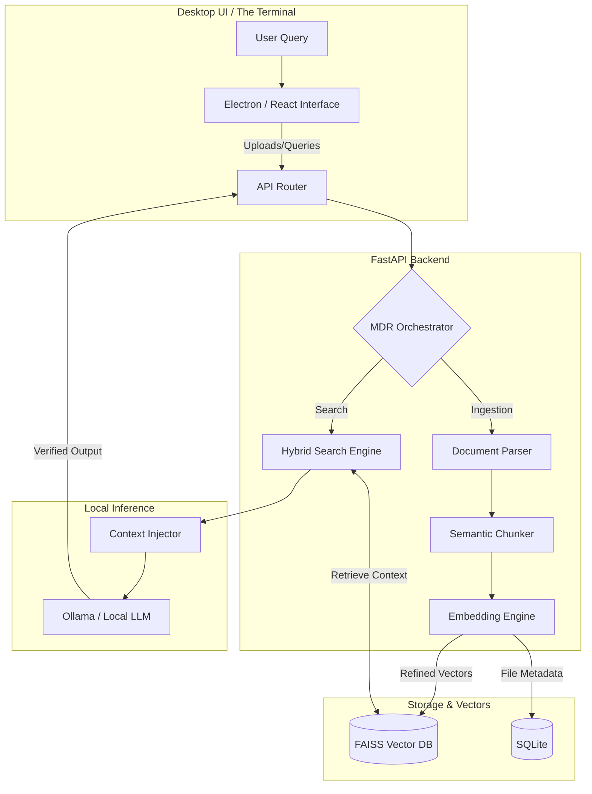

<div align="center">

# ⬛ Project Macrodata

**An Air-Gapped Macrodata Refinement (MDR) Pipeline & Knowledge System**

[]()
[]()
[]()
[]()

Project Macrodata is a highly secure, privacy-first desktop AI architecture built for zero-trust environments. It executes **Macrodata Refinement (MDR)**—systematically ingesting, chunking, and embedding chaotic unstructured data into an isolated vector space. Coupled with a local LLM, it achieves enterprise-grade document retrieval with absolute data sovereignty and zero cloud dependency.

[Features](#-core-capabilities) • [Architecture](#-system-architecture) • [The MDR Pipeline](#-the-mdr-pipeline-retrieval-engine) • [Installation](#-quickstart)

</div>

---

## 📌 Executive Summary

Modern AI solutions inherently rely on cloud-compute, creating an unacceptable attack surface for proprietary data. Project Macrodata mitigates this by severing the connection to external APIs. It utilizes a highly tuned MDR Pipeline to perform Advanced Retrieval-Augmented Generation (RAG) strictly on local hardware. The result is cloud-comparable context retrieval, zero data leakage, and mathematically enforced hallucination boundaries.

---

## 🏗 System Architecture

The architecture is strictly decoupled, container-ready, and designed for local isolation.



---

## 🔬 The MDR Pipeline (Retrieval Engine)

Standard semantic search often fails on highly technical or vocabulary-dense documents. The MDR Pipeline utilizes a dual-path retrieval mechanism to guarantee precision during the data refinement process.

### 1. Hybrid Search Implementation
To balance semantic understanding with exact-keyword matching, the retrieval score is a fused computation of dense vector similarity and sparse lexical scoring:

$$Score_{final} = \alpha \cdot \cos(\mathbf{q}, \mathbf{d}) + (1 - \alpha) \cdot \text{BM25}(q, d)$$

Where $\cos(\mathbf{q}, \mathbf{d})$ is the cosine similarity between the query and document embeddings, and $\alpha$ is a tunable weight parameter to bias towards either semantic meaning or exact terminology.

### 2. Hallucination Control & Strict Citation
Responses are mathematically constrained. If the highest retrieved chunk similarity falls below a defined threshold $\tau$, the system forces a null response to prevent model fabrication:

$$If \max(\cos(\mathbf{q}, \mathbf{d})) < \tau \implies \text{Return "Insufficient Context"}$$

Every valid response requires a cryptographic or pointer link back to the exact chunk, enforcing a strict `Source : Page : Confidence` citation mechanism.

---

## 🚀 Core Capabilities

### Base Infrastructure
* **100% Air-Gapped Execution:** No external API requests, no telemetry, no data leakage. Operates completely offline.
* **Macrodata Refinement:** Context-aware splitting of chaotic PDFs using LangChain's `RecursiveCharacterTextSplitter`.
* **High-Speed Vector Indexing:** Powered by FAISS for sub-millisecond semantic similarity search.

### Advanced MLOps & Quality Assurance
* **Multi-Modal Document Ingestion:** Robust parsing architecture supporting complex PDFs (via PyMuPDF/Unstructured), TXT, and Markdown.
* **Deterministic Output:** Strict system prompts combined with retrieved context to suppress inherent LLM hallucination.
* **Memory-Optimized Inference:** Operates quantization (4-bit/8-bit) via Ollama to run 7B parameters locally without thermal throttling.

---

## ⚙️ Tech Stack Overview

| Layer | Technologies | Role |
| :--- | :--- | :--- |
| **Frontend UI** | React, Electron, Zustand, Tailwind | Cross-platform client, state management, desktop wrapper |
| **Backend API** | FastAPI, Python 3.10+ | Asynchronous routing, orchestrating the MDR Pipeline |
| **Data Engine** | LangChain, sentence-transformers | Embedding generation, query rewriting, data parsing |
| **Storage Node**| FAISS, SQLite, Local FS | Vector storage, metadata indexing, persistent documents |
| **Local Logic** | Ollama (Mistral-7B-Instruct) | Offline quantized LLM execution |

---

## 🏁 Quickstart

### Prerequisites
* [Docker](https://www.docker.com/) & Docker Compose
* [Ollama](https://ollama.com/) (installed and running locally)
* Node.js v18+ & Python 3.10+

### 1. Initialize Local Intelligence
```bash
# Pull the required foundational model into your local Ollama instance
ollama pull mistral
```

### 2. Boot the MDR Pipeline
```bash
git clone [https://github.com/yourusername/Project-Macrodata.git](https://github.com/yourusername/Project-Macrodata.git)
cd Project-Macrodata

# Build and deploy the FastAPI backend and Vector DB
docker-compose up --build -d
```

### 3. Launch Desktop Interface
```bash
cd frontend
npm install
npm run dev
```

---

## 📁 Repository Structure

```text
Project-Macrodata/
├── backend/                  # FastAPI Application
│   ├── api/                  # Route definitions (/query, /upload)
│   ├── core/                 # Config, security, logging
│   ├── mdr_pipeline/         # Embeddings, chunking, FAISS wrapper
│   └── models/               # Pydantic schemas
├── frontend/                 # React + Electron App
│   ├── src/components/       # UI, terminal view, upload zones
│   ├── src/store/            # Zustand state
│   └── electron/             # Main process scripts
├── data/                     # Persistent local volumes (Severed)
│   ├── db/                   # SQLite metadata
│   └── vector_index/         # FAISS binary dumps
├── docker-compose.yml
└── README.md
```

---

## 📊 Performance & Optimization

The MDR Pipeline is engineered to balance hardware constraints with output fidelity:
* **Embedding Engine:** `all-MiniLM-L6-v2` guarantees rapid encoding with minimal VRAM overhead.
* **Index Configuration:** `IndexFlatL2` is utilized for absolute precision in small-to-medium document stores, with architectural support to swap to `IndexIVFPQ` for scaling up to millions of refined vectors.

---

## 🛡️ Security Note
This software is provided as a zero-trust environment. Data persistence is strictly local. For enterprise deployment, AES-256 encryption on the `/data` directory is recommended to protect the physical FAISS indices and SQLite DB at rest.
